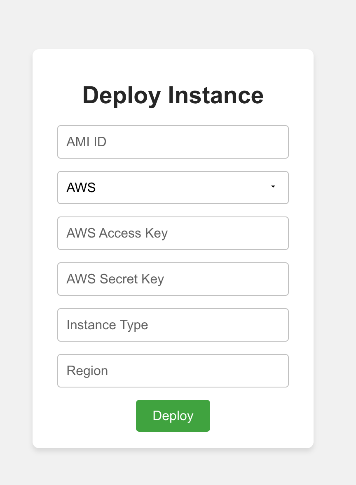
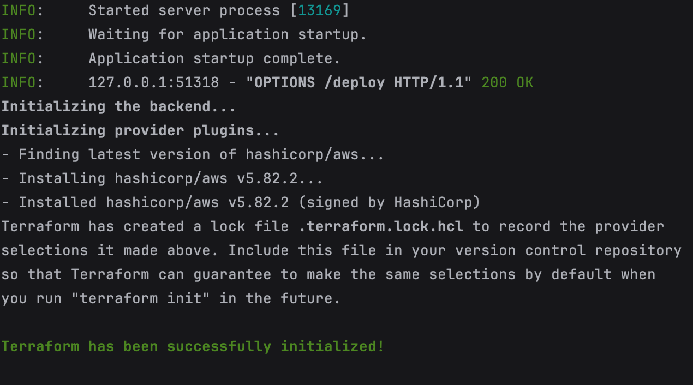
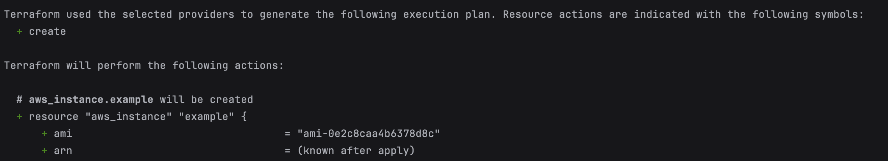
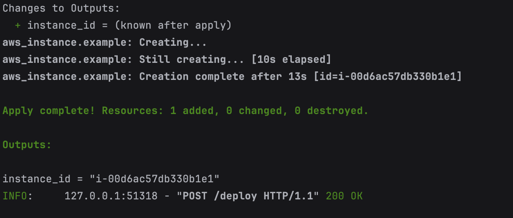
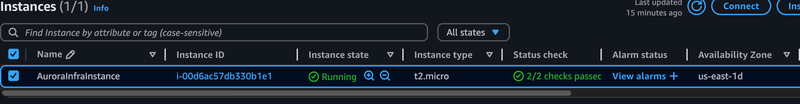

# **AuroraInfra**

AuroraInfra is a deployment platform that enables users to deploy cloud infrastructure seamlessly on AWS, GCP, and Azure. 

---

## **Getting Started**

Follow these steps to set up and run the AuroraInfra.

---

## **Prerequisites**

1. **Node.js**:
   - Ensure you have **Node.js** (version 16 or higher) installed.
   - Download from [Node.js Official Website](https://nodejs.org/).

2. **Code Editor**:
   - Use any editor of your choice. We recommend **PyCharm**, **Visual Studio Code**, or similar.

3. **Git**:
   - Make sure Git is installed for cloning the repository.
   - Download Git from [Git Downloads](https://git-scm.com/downloads).

---

## **Steps to Execute**

### **1. Clone the Repository**
1. Open your terminal and run the following command to clone the AuroraInfra repository:
   ```bash
   git clone <repository-url>
   cd AuroraInfra/frontend

### **2. Install Dependencies**
1. Install Node.js Dependencies:
   ```bash
    npm install

2. Check Installed Dependencies:
   ```text
    "dependencies": {
      "react": "^17.0.2",
      "react-dom": "^17.0.2",
      "react-scripts": "^4.0.3"
    }
3. Fix Missing Dependencies:
   ```bash
    rm -rf node_modules package-lock.json
    npm install
### **3. Start the Frontend Development Server**
1. Install Node.js Dependencies:
   ```bash
    npm start
2. The server will automatically open the app in your default browser at::
   ```text
    http://localhost:3000
## Front-end Overview

Here’s how the frontend form looks:



## **Backend Setup**

### **Prerequisites**

1. **Python**:
   - Ensure you have **Python 3.8 or higher** installed.
   - Download from [Python Official Website](https://www.python.org/).

2. **Pip (Python Package Manager)**:
   - Verify installation:
     ```bash
     pip --version
     ```

3. **Terraform**:
   - Install Terraform by downloading it from [Terraform Downloads](https://www.terraform.io/downloads.html).
   - Verify installation:
     ```bash
     terraform --version
     ```

---

### **Steps to Execute**

#### **1. Navigate to the Backend Directory**
1. Open your terminal and navigate to the backend folder:
   ```bash
   cd AuroraInfra/backend
#### **2. Navigate to the Backend Directory**
1. Install the required Python libraries:
   ```bash
   pip install -r requirements.txt
   
#### **3. Start the backend server**
1. Run the backend server using Uvicorn:
   ```bash
   uvicorn main:app --reload

### **Backend Overview**
The backend handles API requests from the frontend and executes Terraform configurations to deploy cloud infrastructure.

Here’s how the terminal looks when request reaches backend:









